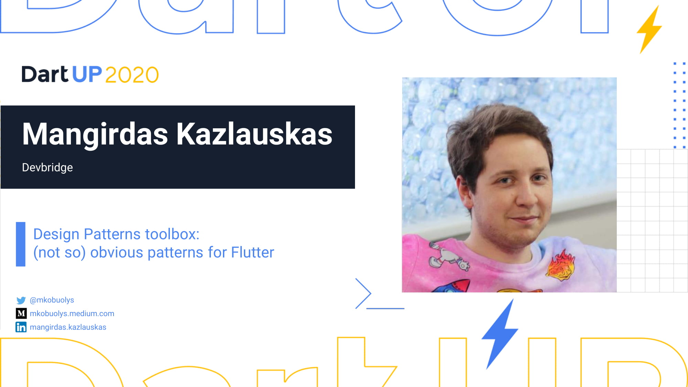

# DartUPify - Design Patterns example app for DartUP 2020 conference



This example app shows how different Design Patterns could be used together in order to create a single application.

Design Patterns used in the app:

- Abstract Factory
- Composite
- Command
- Memento

## Presentation

Presentation slides are provided [here](presentation-slides.pdf).

Talk video could be found [here](https://www.youtube.com/watch?v=5vtthFGTaSs).

## Building

You can follow these instructions to build the app and install it onto your device.

### Prerequisites

If you are new to Flutter, please first follow the [Flutter Setup](https://flutter.dev/setup/) guide.

### Building and installing the Flutter Design Patterns app

```
git clone https://github.com/mkobuolys/dartupify-dartup2020.git
cd dartupify-dartup2020
flutter run
```

The `flutter run` command both builds and installs the Flutter app to your device or emulator.
